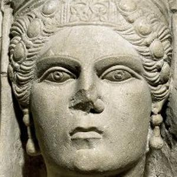

## A demonstration script for facial detection

This repository holds a sample terminal script for interacting with the British Museum's RDF endpoint to retrieve images and then
using OpenCV, recognise faces within the images. These are then cropped and stored in a directory on your machine.

This is a very simple example and pulls  busts (100 of them) from the British Museum collection and uses them to
create image montages. Within the folder are all the files pulled from the example script.

An example detected face can be shown below:

Original image

Detected face

There are also two montages created at the end of this script:

All images originally pulled from RDF:

All faces identified within the original images:

**I am rubbish at Python, so this is a learning project.**

# To use

Clone this folder to your computer:

`$ git clone https://github.com/BritishMuseumDH/britishMuseumFaceDetection.git`

Change to the directory:

`$ cd britishMuseumFaceDetection`

Install the requirements (I recommend doing this in a virtual environment):

`$ pip install -r requirements.txt`

Now run the script:

`$ python britishMuseumFaces.py -p /path/to/folder`

This should run and output any error messages to your terminal.

# License

MIT for script. CC-BY-NC-SA for all image content, copyright the Trustees of the British Museum.

# Author

Daniel Pett, Digital Humanities Lead, British Museum
